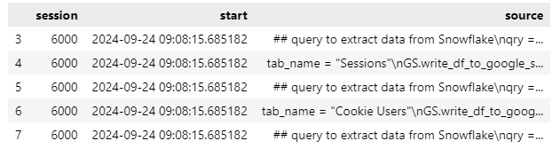
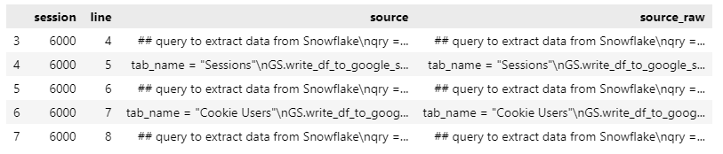

# How to Recover a Deleted Jupyter Notebook

**Published:** September 28, 2024  
**Tags:** Python, Jupyter Notebook
**Excerpt:** This article shows how to recover unsaved or deleted Jupyter Notebook code cells using the IPython kernel history stored in an SQLite database. It walks you through locating the history.sqlite file, extracting code with SQL, and saving it into a new notebook using nbformat. Only Python, R, or Julia code cells can be recovered — not markdown.
**Slug:** recover-deleted-jupyter-notebook
**Cover Image Path:** blog_images/blog_01_cover.png

---

# Unsaved or Deleted Jupyter Notebooks

Your IDE might crash, or you might forget to save your changes, assuming they're already saved. You or someone else might accidentally delete your Jupyter Notebook—one you've spent hours working on.  For instance:

- you've lost your Jupyter Notebook and don't have a backup
- you can't find your deleted Jupyter Notebook in your recycle bin
- you don't have .ipynb_checkpoints—which are saved snapshots of your Jupyter Notebook

This guide will help you recover your lost Jupyter Notebook, regardless of the reason for its disappearance. Whether you want to avoid rewriting it or need to back it up quickly, you're in the right place.

# Recovering unsaved or deleted Jupyter Notebook using **IPython kernel history**

Every executed code cell is stored in an SQLite database, which you can use to recover your Jupyter Notebook code cells! Unfortunately, only Python/R/Julia code cells are saved, not markdown cells.

First, navigate to your home directory:

- **On Linux/WSL2/Mac**: `~/.ipython/profile_default`
- **On Windows**: `C:\Users\<YourUsername>\.ipython\profile_default`

Make sure to show hidden files:

- **On Mac**: Press `Cmd + Shift + .` (dot) to reveal hidden files and directories.
- **On Windows**: In File Explorer, go to the "View" tab and check the "Hidden items" box.

Once you're in the `.ipython/profile_default` directory, you should see the `history.sqlite` file. This is where all your executed Jupyter Notebook code cells are stored. You can explore this database using any database explorer or terminal commands to inspect its tables and content. However, the following intuitive Jupyter Notebook code will also help you do this:

```python
import sqlite3 as sql  # necessary to load/read your database
import pandas as pd    # necessary to view/manipulate tables
import nbformat as nbf # necessary to recover/nicely format back your recovered code cells
```

Once you've imported the required packages (if they're not installed, use `pip install nbformat` or so), all you need to do is provide the correct path to your `history.sqlite` file. Knowing when you last executed the lost Jupyter Notebook can help you more easily find the right code.

```python
path_to_sqlite_database = '~/.ipython/profile_default/history.sqlite'
start_date = '2024-09-24 09:00:00'
end_date = '2024-09-24 10:00:00'

conn = sql.connect(path_to_sqlite_database )

df = pd.read_sql_query(f"""
	select 
		s.session, s.start, s.end, h.source
	from sessions as s
	join history  as h using (session)
	where s.start between {start_date} and {end_date}""", conn)
df.head()
```



Now, explore the dataframe and locate your code snippets in the "source" column. Once you find a snippet, note the corresponding session number from the "session" column—this reflects each time you start or restart the Jupyter Kernel. Remember this session number for the next step.

```python
my_sessions = 6000
df_session_content = pd.read_sql_query(f"""
	select *    
	from history 
	where session = {my_session}""", conn)
df_session_content.head()
```



After creating the above dataframe, filter it to include only distinct rows based on the "source" column. This ensures that running the code cell multiple times within the same session doesn't result in duplicate rows. Finally, use the `nbformat` package to write the required rows from the "source" column into a new Jupyter Notebook, as shown below:

```python
df_session_content= df_session_content.drop_duplicates(subset='source')
# Create a new Jupyter Notebook
nb = nbf.v4.new_notebook()

# Add each row in df['source'] as a new cell
cells = []
for row in df_session_content['source']:
    cell = nbf.v4.new_code_cell(row)
    cells.append(cell)

nb['cells'] = cells
# Save the notebook to a file
with open('new_notebook.ipynb', 'w') as f:
    nbf.write(nb, f)
print("Jupyter Notebook created successfully.")
```

Voilà! You have recovered the code cells of your Jupyter Notebook. However, you'll need to manually input all markdown cells if you had them before.

> Troubles are like the night... Rest, don’t despair; morning will surely come.