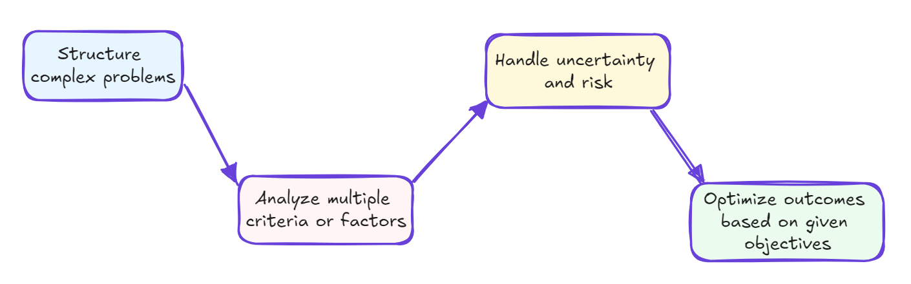

# Multi-Criteria Decision-Making using Python

**Published:** October 06, 2024  
**Tags:** Python, Research, Decision Making  
**Excerpt:** Decision-making means choosing the best option based on goals and trade-offs. MCDM adds complexity by balancing multiple factors. Tools like Python and models (e.g., WSM, TOPSIS) help make objective, data-driven choices.
**Slug:** multi-criteria-decision-making-python

---

# Introduction to Decision-Making

## Decision Making

*When faced with multiple options, each with its own pros and cons, how do you choose the best one? This is where decision-making comes into play.*

***Decision-making*** is the process of choosing a course of action from various alternatives to achieve a desired outcome. It involves evaluating options, weighing the consequences, and selecting the best path forward based on available information and your goals.

In daily life, we make many important decisions, such as:

- Should you make a purchase or not?
- Should you pursue a master's degree or enter the workforce after completing your bachelor's?
- Should you accept a job offer or decline it?

Generally, the decision-making process follows these steps:

Take, for example, deciding whether to accept a job offer. The process might look like this:

1. **Identify alternatives:** Accept or decline the offer.
2. **Gather information:** Consider salary, benefits, job responsibilities, company culture, etc.
3. **Evaluate options:** Weigh the pros and cons of accepting versus declining.
4. **Consider consequences:** Think about how each choice impacts your career and life.
5. **Make a choice:** Select the option that aligns best with your goals and values.

This approach can be applied to anything from everyday choices to complex personal or business decisions. The key is to systematically analyze the options and their outcomes before making your final decision.

## Multi-Criteria Decision-Making

In both daily life and business, decision-making can get complicated because we often need to choose from several options (alternatives), each based on multiple criteria (attributes, information).

Let’s revisit the job offer example and make it more realistic. Suppose you have offers from five different companies. Now, you have to compare their salaries, benefits, company size, culture, proximity to home, and alignment with your previous experience, among other factors. Which one will you choose? Will you base your decision solely on one criterion, like salary? Many of us tend to do this, but it can cause us to overlook great opportunities.

***Multi-criteria decision-making (MCDM)*** is the process of evaluating multiple, often conflicting criteria to reach the best possible decision.

***For example: Choosing a new smartphone:***

***Criteria:*** *Price,  Weight, Battery Life, Storage capacity, RAM*

***Alternatives:*** Phone A*, Phone B, Phone C, Phone D*

| Phone | Price (EUR) | Weight (Gram) | Batter Life (Hour) | Stogare (GB) | RAM (GB) |
| --- | --- | --- | --- | --- | --- |
| A | 💵💵 | 🎱🎱 | ⌛⌛ | 💿 | 💽💽💽 |
| B | 💵💵 | 🎱🎱 | ⌛ | 💿💿 | 💽💽 |
| C | 💵 | 🎱🎱🎱 | ⌛⌛ | 💿💿💿 | 💽💽 |
| D | 💵💵💵 | 🎱 | ⌛⌛⌛ | 💿 | 💽 |

In the table above, Option C has the lowest price, while Option D has the lightest and the longest battery life. Option B is average across most criteria but needs more battery life, and Option A has excellent RAM. So, which one should you choose?

In this scenario, you'd evaluate each phone option based on these criteria, potentially assigning weights to each factor depending on its importance to you. You could use a scoring system or a decision matrix to compare the options more systematically.

The "best" choice will depend on how you prioritize and balance these factors based on your needs and preferences. Multi-criteria decision-making (MCDM) helps structure this process, enabling a more objective and thorough evaluation of the available options.

# Multi-Criteria Decision-Making Implementation using Python

There are online tools that simplify the decision-making process. However, implementing Multi-Criteria Decision-Making (MCDM) in Python can help you automate and streamline your decisions for free! But if you still prefer using ready-made tools, here are some free and paid decision-making options:

[Free MCDM Calculator](https://people.revoledu.com/kardi/tutorial/AHP/MCDM_Calculator.html)

[Paid MCDM Calculator](https://www.1000minds.com/decision-making/what-is-mcdm-mcda)

## Different MCDM Algorithms

Decision-making algorithms are systematic methods designed to assist individuals or systems in choosing among alternatives. They aim to:



These algorithms can be either quantitative or qualitative, drawing on disciplines such as mathematics, statistics, economics, and computer science. They vary from simple rule-based approaches to sophisticated machine learning models.

Key features of many decision-making algorithms include:

- Processing large amounts of data
- Considering multiple, often conflicting, criteria
- Incorporating stakeholder preferences
- Managing uncertainty and probabilistic outcomes
- Scaling to handle different problem sizes and complexities

The choice of algorithm depends on the problem’s nature, the available data, computational resources, and the desired balance between simplicity and accuracy. While these algorithms provide valuable insights and recommendations, they typically serve as tools to support human decision-makers, rather than replacing human judgment altogether.

Here's a brief overview of some common decision-making algorithms:

| Algorithm | Overview |
| --- | --- |
| Decision Trees | • Graphical representation of decisions and their outcomes • Useful for sequential decision-making processes |
| Analytic Hierarchy Process (AHP) | • Breaks down complex decisions into hierarchies • Uses pairwise comparisons to establish priorities |
| TOPSIS (Technique for Order Preference by Similarity to Ideal Solution) | Chooses alternatives closest to ideal solution and farthest from the negative-ideal solution |
| PROMETHEE (Preference Ranking Organization Method for Enrichment Evaluations) | • Outranking method using pairwise comparisons of alternatives • Considers preference functions for each criterion |
| ELECTRE (Elimination and Choice Expressing Reality) | • Family of outranking methods • Uses concordance and discordance indices |

Each algorithm has its strengths and is suited to different types of decision problems. The choice of algorithm depends on the specific context, data availability, and complexity of the decision at hand.

## MCDM Implementation Using Python

There are many Python packages available for implementing MCDM. One of the most popular is [scikit-criteria](https://scikit-criteria.quatrope.org/en/latest/) , which provides implementations of various decision-making algorithms. Below, we’ll use this Python package to apply MCDM to a real-life scenario - ***buying a smartphone***.

Let’s begin by importing all the necessary Python packages. If any are missing, you can easily install them using the command: `pip install package_name`.

```python
import pandas as pd
import skcriteria as skc
from skcriteria.pipeline import mkpipe
from skcriteria.preprocessing.invert_objectives import InvertMinimize, NegateMinimize
from skcriteria.preprocessing.scalers import SumScaler, VectorScaler
from skcriteria.agg.simple import WeightedProductModel, WeightedSumModel
from skcriteria.agg.similarity import TOPSIS
```

Now, let's create our dataframe. The indices will represent the alternatives—smartphones we are considering buying—and the columns will be the various criteria we will use for comparison:

```python
data = {
    "Phone": ["Samsung Galaxy S24", "Google Pixel 9", "Xiaomi 14", "Apple iPhone 15"],
    "Price (EUR)": [611, 830, 700, 700],
    "Weight (Gram)": [168, 198, 193, 171],
    "Battery Life (Hour)": [12, 13, 12, 13.5],
    "Storage (GB)": [128, 128, 512, 128],
    "RAM (GB)": [8, 12, 12, 6],
}
df_phones = pd.DataFrame(data).set_index("Phone")
df_phones
```

| **Phone** | **Price (EUR)** | **Weight (Gram)** | **Battery Life (Hour)** | **Storage (GB)** | **RAM (GB)** |
| --- | --- | --- | --- | --- | --- |
| Samsung Galaxy S24 | 611 | 168 | 12.0 | 128 | 8 |
| Google Pixel 9 | 830 | 198 | 13.0 | 128 | 12 |
| Xiaomi 14 | 700 | 193 | 12.0 | 512 | 12 |
| Apple iPhone 15 | 700 | 171 | 13.5 | 128 | 6 |

We have 4 smartphone options with 5 criteria. The next step is to create a special data format for `scikit-criteria`, called a `DecisionMatrix`. For this, we’ll provide our core data (the options and criteria), specify which are alternatives (the options), and define the criteria.

Next, we need to specify the objective for each criterion. For example, in the smartphone comparison, we aim to **minimize** the cost while **maximizing** storage capacity.

Optionally, we can assign weights to each criterion. If no weights are provided, all criteria will have equal importance. However, if certain criteria matter more, you can adjust the weights. For instance, you might give more weight to the price, considering it more important than RAM, while battery life may also be more critical than storage capacity.

Here’s how you can create your `DecisionMatrix` from the Pandas DataFrame:

```python
dm = skc.mkdm(
    df_phones,
    alternatives=df_phones.index,
    criteria=df_phones.columns,
    objectives=["min", "min", "max", "max", "max"],
    weights=[5, 3, 3, 2,1],
)
dm
```

|  | **Price (EUR)[▼ 5.0]** | **Weight (Gram)[▼ 3.0]** | **Battery Life (Hour)[▲ 3.0]** | **Storage (GB)[▲ 2.0]** | **RAM (GB)[▲ 1.0]** |
| --- | --- | --- | --- | --- | --- |
| Samsung Galaxy S24 | 611 | 168 | 12.0 | 128 | 8 |
| Google Pixel 9 | 830 | 198 | 13.0 | 128 | 12 |
| Xiaomi 14 | 700 | 193 | 12.0 | 512 | 12 |
| Apple iPhone 15 | 700 | 171 | 13.5 | 128 | 6 |

*4 Alternatives x 5 Criteria*

As you can see, the `DecisionMatrix` is very similar to our Pandas DataFrame. The only noticeable difference is the upward and downward arrows in the column headers, indicating the objective for each criterion. These arrows show whether we aim to **maximize** or **minimize** a criterion.

For example, an upward arrow (↑) means we're trying to **maximize** that criterion (e.g., storage), while a downward arrow (↓) means we're aiming to **minimize** it (e.g., cost).

Now that our decision matrix is ready, we can use our preferred algorithm to rank the alternatives. For simplicity, let’s start with the **Weighted Sum Model** (WSM).

---

### Quick Intro to Weighted Sum Model

The **Weighted Sum Model (WSM)** is a straightforward multi-criteria decision-making technique used to rank alternatives based on multiple criteria. Here’s a brief overview:

1. **Purpose:** WSM helps to evaluate different options by scoring them against several criteria and aggregating these scores into a single overall score for each alternative.
2. **Process:**
    - **Criteria Weighting:** Each criterion is assigned a weight based on its importance relative to the other criteria.
    - **Score Calculation:** Each alternative is scored for each criterion.
    - **Weighted Scores:** The scores for each criterion are multiplied by their respective weights.
    - **Aggregation:** The weighted scores are summed to produce an overall score for each alternative.
3. **Decision Making:** The alternative with the highest overall score is considered the best option.
4. **Assumptions:** WSM assumes that all criteria are commensurable and can be compared directly, which may not always be true in real-world scenarios.
5. **Limitations:** While simple and intuitive, WSM may not effectively handle criteria with different units or non-linear relationships.

Overall, the Weighted Sum Model is popular due to its ease of use and straightforward implementation, making it a good starting point for multi-criteria decision-making.

---

```python
ws_pipe = mkpipe(
    InvertMinimize(),
    SumScaler(target="both"),
    WeightedSumModel(),
)
df_ws_ranks = ws_pipe.evaluate(dm).to_series().to_frame("Rank").sort_values("Rank")
df_ws_ranks
```

|  | **Rank** |
| --- | --- |
| **Alternatives** |  |
| Xiaomi 14 | 1 |
| Samsung Galaxy S24 | 2 |
| Apple iPhone 15 | 3 |
| Google Pixel 9 | 4 |

Sweet and quick! 🙂 The Weighted Sum Model has ranked our smartphone options, and the **Xiaomi 14** emerges as the “best” choice among the four alternatives, despite not having the lowest price. Its storage capacity played a significant role in securing the top rank.

Logically, this makes sense—nowadays, it’s easy to fill up device storage quickly, leading many users to subscribe to cloud services for extra space. It’s quite frustrating that in 2024, brands continue to release devices with relatively low storage capacities. Are they planning to push us toward their cloud services to boost their income?

> Disclaimer: I am not affiliated with any of the brands mentioned above. Prices and phone specifications were quickly sourced from the internet for demonstration purposes only!
> 

### Ranking Using Various Algorithms

While the Weighted Sum Model (WSM) is a useful starting point, more sophisticated models can offer additional insights in MCDM. The `scikit-criteria` library implements several advanced models, making it easier to apply and compare different MCDM techniques. Let's explore two alternatives to WSM:

1. ***Weighted Product Model (WPM)***: Another relatively simple model that uses multiplication instead of addition.
2. ***Technique for Order of Preference by Similarity to Ideal Solution (TOPSIS)***: A popular model that considers the distance from both ideal and negative-ideal solutions.

Key differences in implementation:

- For WSM and WPM, we can continue using the SumScaler for normalization.
- TOPSIS, being based on distance calculations, requires the use of VectorScaler instead of SumScaler.
- Apart from this change in scaler, the implementation process remains similar across all three models.

To get a comprehensive view of our decision problem, let's apply all three models (WSM, WPM, and TOPSIS) and add their rankings to our initial dataframe.

```python
ws_pipe = mkpipe(
    InvertMinimize(),
    SumScaler(target="both"),
    WeightedSumModel(),
)
wp_pipe = mkpipe(
    InvertMinimize(),
    SumScaler(target="both"),
    WeightedProductModel(),
)
tp_pipe = mkpipe(
    NegateMinimize(),
    SumScaler(target="weights"),
    VectorScaler(target="matrix"),
    TOPSIS(),
)
df_ws_ranks = ws_pipe.evaluate(dm).to_series().to_frame("Weigthet Sum Rank")
df_wp_ranks = wp_pipe.evaluate(dm).to_series().to_frame("Weighted Product Rank")
df_tp_ranks = tp_pipe.evaluate(dm).to_series().to_frame("TOPSIS Rank")

df_final = pd.concat([df_ws_ranks, df_wp_ranks, df_tp_ranks], axis=1)
df_final = df_final.merge(df_phones, left_index=True, right_index=True)
df_final = df_final.sort_values("Weigthet Sum Rank")
df_final
```

|  | **Weigthet Sum Rank** | **Weighted Product Rank** | **TOPSIS Rank** | **Price (EUR)** | **Weight (Gram)** | **Battery Life (Hour)** | **Storage (GB)** | **RAM (GB)** |
| --- | --- | --- | --- | --- | --- | --- | --- | --- |
| **Phone** |  |  |  |  |  |  |  |  |
| Xiaomi 14 | 1 | 1 | 1 | 700 | 193 | 12.0 | 512 | 12 |
| Samsung Galaxy S24 | 2 | 2 | 2 | 611 | 168 | 12.0 | 128 | 8 |
| Apple iPhone 15 | 3 | 3 | 3 | 700 | 171 | 13.5 | 128 | 6 |
| Google Pixel 9 | 4 | 4 | 4 | 830 | 198 | 13.0 | 128 | 12 |

Since our dataset is small and has few features, all models currently rank the alternatives the same way. However, in real-world scenarios, you may have dozens or even hundreds of alternatives with many more criteria. In those cases, different models can produce varying rankings. You can either choose a model based on its specific logic or take an average of several models' rankings for a more balanced approach.

# Conclusion

Taking decisions and shaping our future is in our hands—this is the free will of humanity from the beginning. Decisions can lead to either flourishing or punishing consequences, so we should strive to make the best possible choices. Ideally, we shouldn't base decisions on a single criterion. It's wise to consider multiple factors. However, managing many criteria and alternatives can quickly become overwhelming, leading to biased decisions. To avoid these traps, data-driven decision-making and specialized algorithms can save time and help us make optimal choices.

In the age of data, it's easy to find relevant information on both alternatives and their criteria. So, next time you're making an important decision, follow these three simple steps to avoid missed opportunities:

1. List all alternatives (options).
2. Gather as much information as possible for each.
3. Use ranking algorithms to guide your decision-making.

> ***Do not value anything more than it deserves. Either you will lose it or you will ruin yourself.*
                                                                                    *Rumi***
>