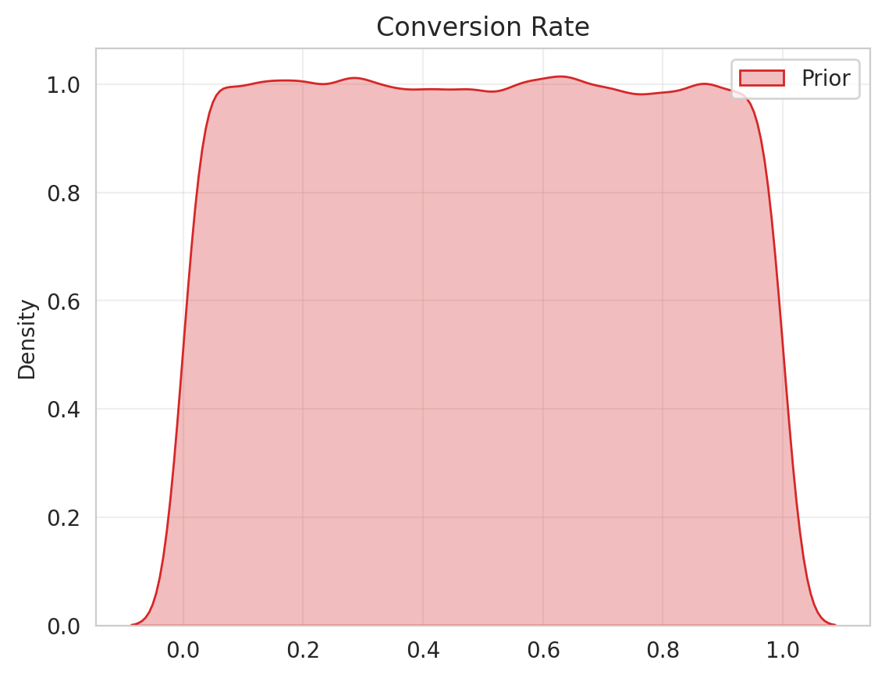
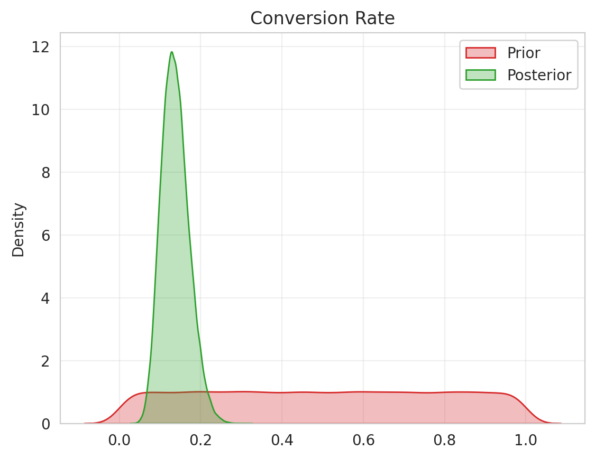
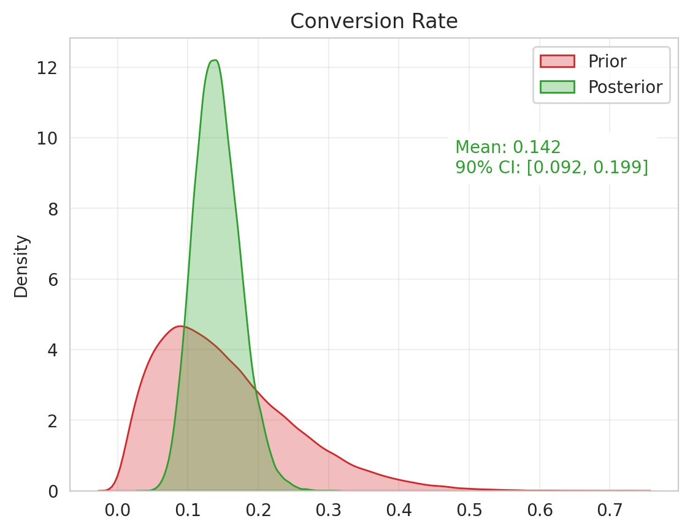

# Bayesian Posterior Calculation with Conjugate Priors

**Published:** March 25, 2024  
**Tags:** Statistics, Bayesian, Python
**Excerpt:** This article discusses the concept of Bayesian inference and how it can be simplified using conjugate priors, through the practical example of estimating an e-commerce website's conversion rate. It highlights the advantage of the Bayesian approach in providing a probability interval, offering a more probabilistic decision-making tool, especially when working with limited data.
**Slug:** bayesian-stat102

---
# Bayesian Posterior Calculation with Conjugate Priors

Bayesian inference, a statistical method that updates beliefs about a hypothesis as more evidence becomes available, can be simplified using conjugate priors. This approach was demonstrated with a Python script simulating an e-commerce website's conversion rate. Using a Bernoulli trial and a Beta distribution as the conjugate prior, the Bayesian approach provided a probability interval for the conversion rate, offering a more probabilistic decision-making tool than the single-point estimate of the Frequentist approach.

# Quick Recap of Bayesian Statistics

Bayesian inference is a statistical method where we update our beliefs about a hypothesis as more evidence or information becomes available. It's like making an educated guess that is refined as you gather more data. You can find a simplified explanation with examples in [my previous post](https://amanabdullayev.me/blog/bayesian-stat101/).

The formula for Bayesian statistics is:

$$
P(H|E) = \frac{P(E|H) \cdot P(H)}{P(E)}
$$

Where:

- `P(H|E)` is the posterior probability - the probability of hypothesis H given the evidence E.
- `P(E|H)` is the likelihood - the probability of the evidence given that the hypothesis is true.
- `P(H)` is the prior probability - the probability of the hypothesis before we see any evidence.
- `P(E)` is the marginal likelihood - the total probability of the evidence.

The hardest part to calculate in this equation is typically the marginal likelihood, **`P(E)`**. This is because it requires integrating over all possible values of H, which can be computationally complex or even impossible, particularly in high-dimensional problems. 

This is where the use of **conjugate priors/posteriors** comes in. Conjugate priors are chosen because they simplify the calculation of the posterior distribution.

# Conjugate priors

Conjugate priors may seem complicated, but they're really just a tool to make Bayesian statistics easier. You can think of them as a shortcut.

In Bayesian statistics, we start with a 'prior' guess about what we think the answer will be. Then we collect some data, and we want to update our guess based on this new data. The updated guess is called the 'posterior'.

Now, the math to go from the prior to the posterior can be really hard. But here's the trick: if we choose our prior in a special way, it makes the math much easier. This special kind of prior is called a '**conjugate prior**'.

So, when we use a conjugate prior, we're making a smart choice about our initial guess to make the math easier down the line.

You can find a list of conjugate priors for most of the discrete and continuous distributions on [Wikipedia](https://en.wikipedia.org/wiki/Conjugate_prior#Table_of_conjugate_distributions).

Let’s take one example from the above Wikipedia table and apply it to a real-life problem.

# Conjugate Priors to Estimate Conversion Rate

Let's say you run an e-commerce website where visitors browse various products, and some of them make a purchase. You're interested in the conversion rate, a Key Performance Indicator (KPI) that shows the proportion of visitors who make a purchase.

We can categorize visitors as follows: a visitor who doesn't make a purchase is denoted as `0` and a visitor who makes a purchase is denoted as `1`. This can be treated as a Bernoulli experiment. We can simulate this scenario with a Python script for 100 visitors, as follows:

```python
from scipy import stats

number_of_visitors = 100
website_visitors = stats.bernoulli.rvs(p=real_conversion_rate, size=number_of_visitors)

>>>> output:
array([0, 1, 0, 0, 0, 1, 0, 0, 1, 0, 0, 0, 0, 0, 0, 1, 0, 0, 0, 0, 0, 0,
       0, 0, 0, 0, 1, 0, 0, 0, 0, 0, 0, 0, 0, 0, 0, 0, 0, 0, 0, 0, 1, 0,
       1, 0, 0, 0, 1, 0, 0, 0, 0, 0, 0, 0, 0, 0, 1, 1, 0, 0, 0, 0, 0, 0,
       0, 0, 0, 1, 1, 0, 0, 0, 0, 0, 0, 0, 0, 1, 0, 0, 0, 0, 0, 0, 1, 1,
       0, 0, 0, 0, 0, 0, 0, 1, 0, 0, 1, 0])
```

In the above code, I intentionally hide the probability argument of Bernoulli's random variable generation with the `real_conversion_rate` variable, since we are going to estimate it. (read until the end if you want to see the value 🙃)

First, let’s count out of 100 people above, how many conversions we have:

```python
import numpy as np
# Count the unique values in the numpy array
unique, counts = np.unique(website_visitors, return_counts=True)

# Print the unique values and their counts
for u, c in zip(unique, counts):
    print(f"{u}: {c}")
  
>>>>output:
0: 86
1: 14
```

In this case, 14 people out of 100 made a purchase. If you apply the Frequentist approach, your conversion rate would be:

$$
Conversion\:rate = \frac{Made\: Purchase}{All\:visitors} = \frac{14}{100}=0.14 \: or \:14\%
$$

Remember that with the Bayesian approach, we start with a prior belief (an initial assumption about the conversion rate). Then, we use the data (evidence) to update our belief about the conversion rate (posterior).

Given that this situation involves a Bernoulli trial, the conjugate prior for a Bernoulli distribution is a Beta distribution. You can refer to [this Wikipedia table for more information](https://en.wikipedia.org/wiki/Conjugate_prior#Table_of_conjugate_distributions).

If you don't have any initial idea about the conversion rate, there's no need to worry. You can use a broad or flat distribution, where you assume that the conversion rate is a number between 0 and 1. This translates to a Beta distribution with parameters: a=1 and b=1, or `Beta(a=1, b=1)`.

```python
# plot a KDE plot with beta distribution a=1 and b=1
prior = stats.beta(a=1, b=1)
sns.kdeplot(data=prior.rvs(size=100_000), color="tab:red", label="Prior")
plt.title("Conversion Rate")
plt.show()
```



Initially, we believe that our conversion rate can range between 0 and 100%. 

Now, let's use our observed data to find a posterior. According to conjugate priors, for a Beta prior with parameters `a` and `b`, posterior will Beta distribution with parameters: `a+number of successes`, `b+number of failures`. In our case, a success is a purchase and a failure is a non-purchase.

Plugging in our 14 purchases and 86 non-purchases, our posterior becomes `Beta(a=15, b=87)`:

```python
# plot a KDE plot with beta distribution a=1 and b=1
prior = stats.beta(a=1, b=1)
posterior = stats.beta(a=1 + 14, b=1 + 86)
sns.kdeplot(data=prior.rvs(size=100_000), color="tab:red", label="Prior")
sns.kdeplot(data=posterior.rvs(size=100_000), color="tab:green", label="Posterior")
plt.title("Conversion Rate")
plt.show()
```



```python
posterior_mean = np.round(posterior.mean(), 3)
posterior_q5, posterior_q95 = posterior.interval(0.9)
print(f"Posterior mean: {posterior_mean}")
print(f"Posterior 90% credible interval: ({posterior_q5:.3f}, {posterior_q95:.3f})")

>>>>output:
Posterior mean: 0.147
Posterior 90% credible interval: (0.094, 0.208)
```

In the Bayesian approach, we consider an entire distribution for our conversion rate, unlike the Frequentist approach, where we only have a single point (14%). This allows us to make a more probabilistic decision by considering, for example, a 90% interval where the real conversion rate might be.

Why would you choose the Bayesian approach over the Frequentist, even though their estimates are quite close (14.7% vs 14%)? Well, the Bayesian approach provides a probability interval. For example, it states that there is a 90% chance that the real conversion rate lies between 9.4% and 20.8%.

**In fact, I initially used a 10% probability to generate Bernoulli ones and zeros in my code:**

```python
from scipy import stats

**real_conversion_rate = 0.1**

number_of_visitors = 100
website_visitors = stats.bernoulli.rvs(p=real_conversion_rate, size=number_of_visitors)

>>>> output:
array([0, 1, 0, 0, 0, 1, 0, 0, 1, 0, 0, 0, 0, 0, 0, 1, 0, 0, 0, 0, 0, 0,
       0, 0, 0, 0, 1, 0, 0, 0, 0, 0, 0, 0, 0, 0, 0, 0, 0, 0, 0, 0, 1, 0,
       1, 0, 0, 0, 1, 0, 0, 0, 0, 0, 0, 0, 0, 0, 1, 1, 0, 0, 0, 0, 0, 0,
       0, 0, 0, 1, 1, 0, 0, 0, 0, 0, 0, 0, 0, 1, 0, 0, 0, 0, 0, 0, 1, 1,
       0, 0, 0, 0, 0, 0, 0, 1, 0, 0, 1, 0])
```

# Conclusion

If you adopt a probabilistic mindset, you can accurately express a 10% conversion rate by stating, "The actual conversion rate lies between 9.4% and 20.8%." 

Moreover, we can determine the true conversion rate with just 100 visitors. This is a key advantage of Bayesian inference, which works well with limited data. For instance, if we apply the previous simulations to a sample of 1000 people instead of 100, the following happens:

```python
Frequentist : 0.108
Posterior mean: 0.109
Posterior 90% credible interval: (0.093, 0.125)
```

In addition, we began with a flat prior, which was a uniform distribution. If we had prior knowledge or a hypothesis about the conversion rate, we could incorporate it into our simulations. For instance, if you had previous knowledge or a gut feeling that the "conversion rate is definitely less than 50%, perhaps around 20%", then with only 100 people, our distributions and final values would look somewhat different. We can use Beta(a=2, b=11) as our prior now. The 90% interval would be slightly lower than before, and the mean would be closer to the frequentist value.



Finally, the Bayesian posterior distribution can be easily calculated for not only the Bernoulli distribution, but also for other distributions such as Normal, Poisson, and Gamma, among others. These calculations use their conjugate priors and observed data, eliminating the need for the marginal likelihood. Simply choose your distribution and insert your values to get your posterior distribution.

> ***Everyone can look at what you can look at, but can everyone see what you can see?***