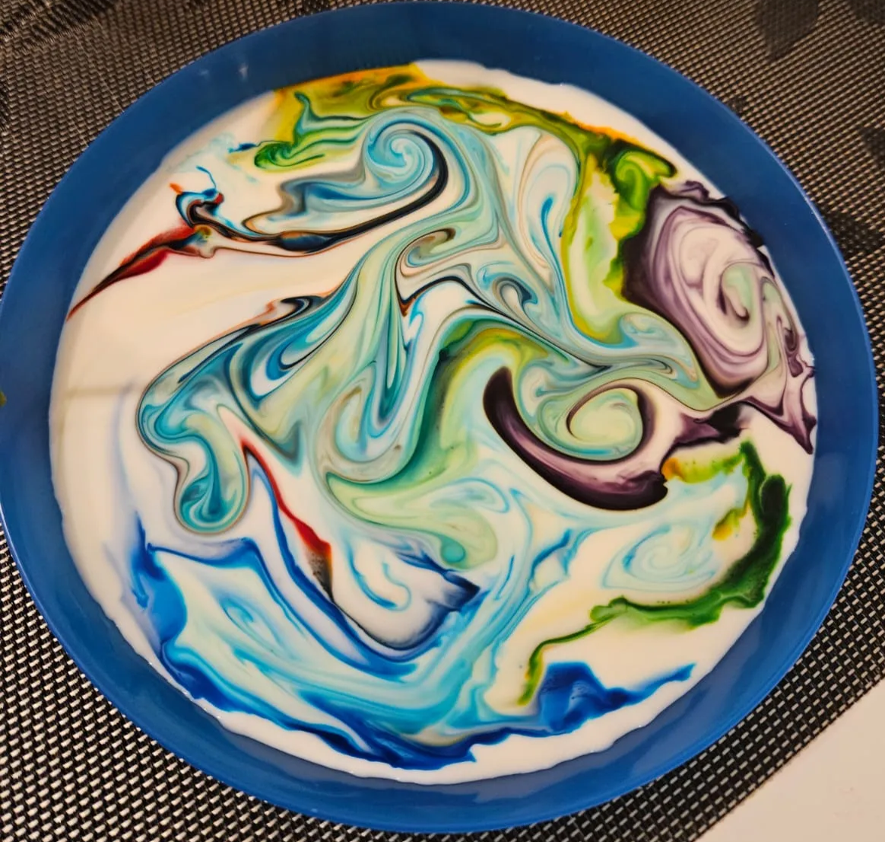
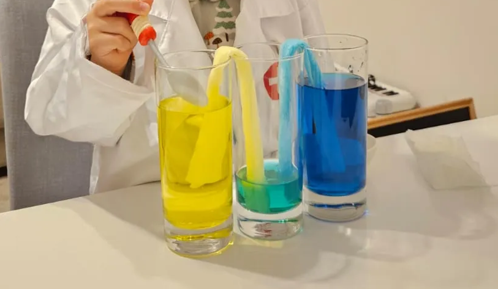

# Experiments at home - fun and science with kids

**Published:** January 13, 2025 
**Tags:** Kids Curiosity, Science is Fun
**Excerpt:** Fun and educational experiments you can easily do at home with your kids to spark their curiosity and encourage hands-on learning.
**Slug:** experiments-at-home-for-kids
**Cover Image Path:** blog_images/blog_05_cover.png

---
# Experiments at home - fun and science with kids

## Benefits of Fun Science Experiments at Home with Kids

Doing fun scientific experiments at home with kids offers several benefits:

1. **Encourages Curiosity**: Experiments spark kids' natural curiosity about the world and how things work.
2. **Boosts Learning**: Hands-on activities make learning concepts in science, technology, engineering, and math (STEM) engaging and memorable.
3. **Strengthens Family Bonding**: Working on projects together fosters quality time and meaningful interactions.
4. **Builds Critical Thinking**: Kids learn to ask questions, make predictions, and solve problems through trial and error.
5. **Fosters Creativity**: Experiments often encourage kids to think outside the box and explore different outcomes.
6. **Teaches Patience**: Waiting for results or redoing a failed attempt teaches perseverance and resilience.
7. **Makes Science Fun**: It breaks the misconception that science is only for classrooms, making it accessible and enjoyable.
8. **Develops Fine Motor Skills**: Activities like measuring, pouring, or assembling develop hand-eye coordination and precision.

In short, it's an enjoyable way to inspire lifelong learning and discovery!

## Ensuring Safety in Home Science Experiments with Kids

However, like any scientific experiment, it's important to approach experiments at home with care, as things can sometimes go wrong. Safety should always be a top priority when performing experiments with kids. **Make sure to take the necessary precautions to prevent accidents**, such as using child-safe materials, wearing protective gear like safety goggles or gloves when needed, and conducting experiments in a well-ventilated area. It’s essential to never let kids perform experiments without adult supervision, especially when dealing with chemicals, heat sources, or any potentially hazardous materials.

Before starting any experiment, explain to your children the potential risks involved and the safety steps they should follow. Emphasize that they should never attempt to repeat or carry out experiments on their own without the knowledge and approval of a parent or guardian. Additionally, ensure that they understand the importance of following instructions carefully and not improvising, as safety protocols are in place for a reason. Educating children on the responsible and safe conduct of experiments not only protects them but also helps instill good habits for future scientific exploration.

By taking these precautions, you can ensure that experimenting at home remains a fun, educational, and most importantly, safe activity for both kids and adults.

## Experiments

### Color Explosion

> **Caution:** Pretty Safe.
> **Difficulty:** Easy to conduct.

#### Ingredients:

1. Milk (preferable with high-fat level)
2. Food coloring
3. Cotton Swab
4. Soap (dish soap, shampoo all should work)
5. Plate or dish 

1. **Pour milk**: Pour enough milk into a shallow but wide dish to cover the bottom.
2. **Add food coloring**: Drop several different colors of food coloring onto the surface of the milk.
3. **Prepare the cotton swab**: Dip a cotton swab into liquid soap.
4. **Create the explosion**: Gently touch the soapy cotton swab to the surface of the milk in the center of the food coloring.
5. **Watch the reaction**: As the soap touches the milk, it breaks the surface tension, causing the food coloring to explode outward in vibrant patterns.

This experiment demonstrates how soap affects fat molecules in the milk, creating a colorful reaction!

[Color Burst with Milk and Food Coloring](https://youtu.be/yuRsn5tWVAo)

You can explore different versions of this experiment along with a detailed explanation of the science behind [it here](https://www.acs.org/education/whatischemistry/adventures-in-chemistry/experiments/colors-move.html).

---

### Color Generation

> **Caution:** Pretty Safe.
> **Difficulty:** Easy to conduct.

#### Ingredients:

1. Food coloring
2. Tap water
3. Paper towel (or piece of fabric that absorbs water quickly)
4. Glasses for drink

1. Take three drinking glasses and place them in a row, touching each other.
2. Fill two of the glasses halfway with water, leaving the middle glass empty.
3. Add several drops of blue food coloring to one glass of water to make it an intense blue. Repeat the process with yellow food coloring in the other glass of water, ensuring the color is vibrant.
4. Arrange the glasses in the following order: the blue-colored water glass, the empty glass in the middle, and the yellow-colored water glass on the other end.
5. Create two "V-shaped bridges" using paper towels. To do this, fold paper towels into thick strips (use multiple layers or thick paper towels for quicker water transport).
6. Immerse one end of a paper towel bridge into the blue-colored water and the other end into the empty glass. Do the same with the second bridge, immersing one end into the yellow-colored water and the other into the empty glass.
7. Wait and observe as the paper towel bridges start transferring the colored water to the empty glass. Over time, the blue and yellow water will mix in the middle glass, creating a green color.

**Note**: The final color will depend on the intensity and balance of the food coloring used. Adjust the quantities if necessary for a more vibrant result.

Try experimenting with other color combinations to see what new colors you can create, such as mixing red with blue or red with yellow. Observe how different combinations produce unique results!

For added fun, turn off the lights in the room and use your phone's flashlight to create a "party lights" effect at home, adding a vibrant and playful atmosphere to the experiment as in the video below:

[Party Lights with Food Coloring](https://youtube.com/shorts/D4GAaEmszWM?feature=share)

---

### Glowing Clementine

> **Caution:** Fire and burn hazard! Handle with care.
> **Difficulty:** Easy to conduct.

#### Ingredients:

1. Sparkler
2. Clementine
3. Lighter
4. Plate or nonflammable dish

1. Take a sparkler and carefully push its top end (the part that burns) through the clementine. Insert it deep enough or until the sparkler's tip comes out from the other side of the fruit.
2. Place the clementine with the inserted sparkler on a wide, nonflammable dish (such as a metal or ceramic plate) to protect furniture or carpets from any sparks or heat damage.
3. Turn off the lights in the room to make it dark. This will enhance the glowing effect.
4. Light the sparkler from the bottom side (the part sticking out beneath the clementine). Be cautious, as sparklers burn at very high temperatures and the leftover wire can become extremely hot. Avoid touching the wire until it has completely cooled down. Additionally, keep children at least 1 meter away from the experiment, as sparks can spread out during the burning process.
5. Watch as the sparkler burns and moves upward. Once the burning part of the sparkler reaches inside the clementine, the fruit will begin to glow, creating a fascinating effect.

[Glowing Clementine](https://youtu.be/l6u0musF5JE?si=bOlfw76LKp8q2fMB)

**Safety Note:** Always handle sparklers carefully and ensure children are supervised during this experiment to avoid any fire or burn hazards.