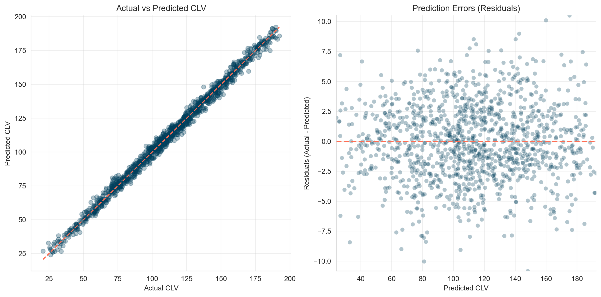
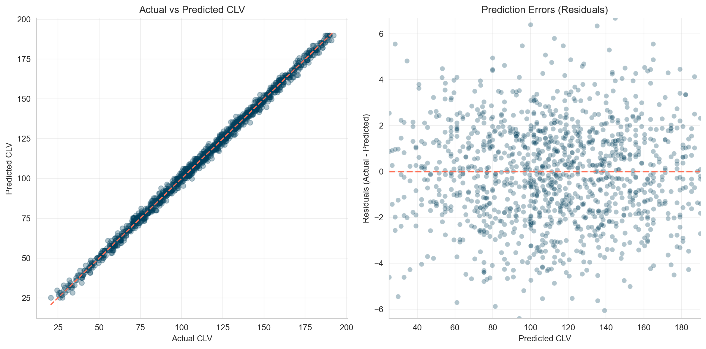
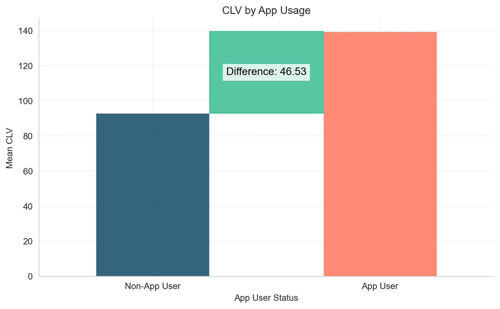
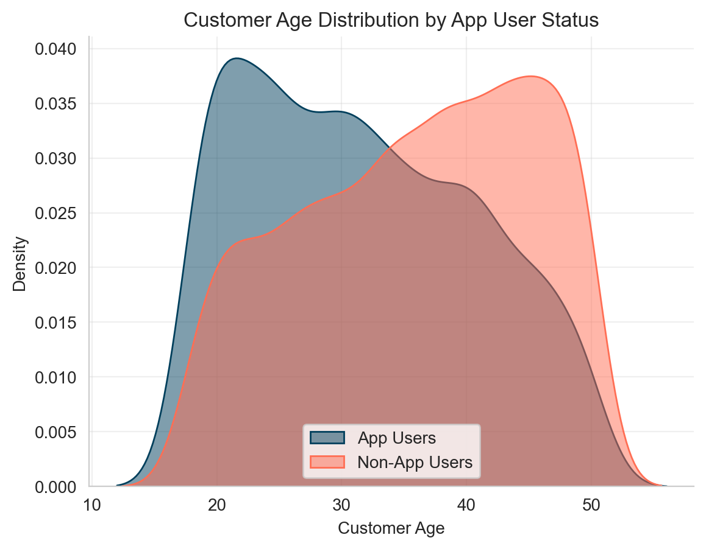
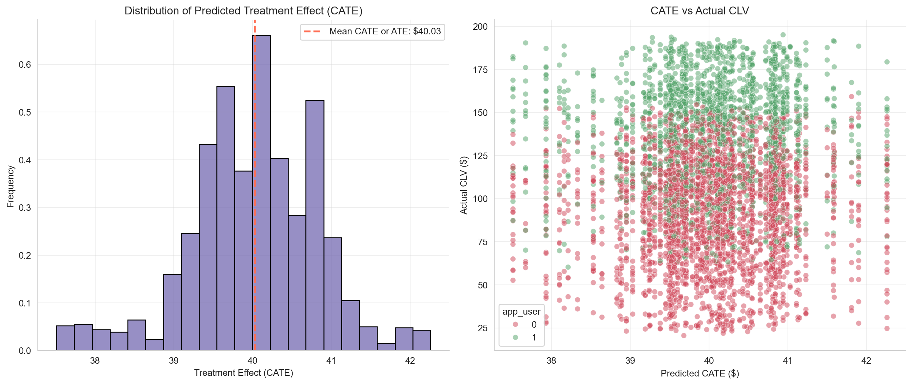

# Causal Models vs Predictive Models: Why It Matters

**Published:** August 16, 2025 
**Tags:** Causality, Python
**Excerpt:** This blog breaks down the key difference between predictive and causal models in data science. Through a hands-on example using customer lifetime value (CLV), it shows how predictive models can mislead and why causal models are essential for making truly actionable business decisions.
**Slug:** causal-vs-predictive-model
**Cover Image Path:** blog_images/blog_07_cover.png

---
# Causal Models vs Predictive Models: Why It Matters

## Introduction

In today’s data-driven world, businesses are realizing a crucial truth: **correlation is not causation**. Just because two metrics move together doesn’t mean one drives the other. Traditional machine learning mostly tells us whether variables move together, but decision-makers usually want to know *which* variable actually influences the outcome—and by *how much*. That’s where **causal inference** comes in.

Initially, I found it challenging to distinguish between predictive models (classical machine learning) and causal models. My initial thought was: *if I train a model—say, a linear regression—then the feature coefficients must represent causal effects*. For example, if β₁ for x₁ (a binary variable) is 5, I assumed the causal effect of x₁ was 5.

But I later realized I was overlooking something important: **confounders**. A confounder is a variable that influences *both* the treatment and the outcome. If you leave it out, your treatment effect estimates are biased. For instance, income may affect both the likelihood of buying insurance (treatment) and health outcomes (outcome). If you could include *all* confounders—which is rarely possible in practice—then the regression coefficient of a feature would indeed represent its causal effect.

It took me some time to appreciate these differences and the methodological nuances between predictive modeling and causal inference. Let’s unpack how they differ, and where they overlap.

### Causality vs Prediction

Causal models aim to answer a powerful question: **“What would have happened if we had done something differently?”** Instead of just spotting correlations, they uncover what actually *causes* change.

They go beyond simple forecasting. Predictive models tell you what *might* happen, but causal models explain *why* it happens—and what would be different under another action.

In short, causal models reveal which levers truly drive outcomes, enabling decisions that move the needle.

**Where Causal Models Are Used**

- **Marketing** → Campaign effectiveness, spend optimization
- **Product** → Drivers of feature adoption or churn
- **Pricing** → Impact of price changes
- **Operations** → Effects of delivery time, staffing, etc.

Businesses don’t just want to **know** what’s happening—they want to **influence** it. Causal models make this possible. They’re no longer academic nice-to-haves—they’re a **competitive edge**.

On the other hand, **predictive models** use historical data to forecast outcomes. They learn patterns between features (`X`) and a target (`Y`), for example:

- Will this user churn?
- What will we sell next month?
- How many orders will this customer make?

But here’s the key: predictive models don’t explain *why* something happens. If you want to know whether a discount **caused** a behavior change, you need a **causal model**.

## Causality vs. Prediction in Action

Imagine you run an e-commerce business and want to estimate **Customer Lifetime Value (CLV)** over 365 days. But why are you really interested in CLV?

- Is it just out of curiosity? Probably not 🙂.
- More likely, you want to *increase* CLV. If you knew which features of your business or which marketing actions drive it up (or down), you could double down on the right levers.
- Or perhaps you want to measure how much **additional CLV** a specific marketing action generates. Then you could directly compare that gain with its cost and calculate ROI.

### CAC Predicts CLV

Now, suppose you have data on how much you spent to acquire customers (CAC) and their CLVs:

```python
df_cac.head()
```

| **customer_id** | **cac** | **clv_365** |
| --- | --- | --- |
| 0 | 15.55 | 32.48 |
| 1 | 52.35 | 104.17 |
| 2 | 90.33 | 178.90 |
| 3 | 66.81 | 135.26 |
| 4 | 61.42 | 123.14 |

You train a Linear Regression model on this and get near-perfect results.

```python
X_train, X_test, y_train, y_test = prep_data_for_regression(df_cac, "clv_365")
# Train a linear regression model
model_1 = LinearRegression()
model_1.fit(X_train, y_train)
y_pred = model_1.predict(X_test)
mse = mean_squared_error(y_test, y_pred)
r2 = r2_score(y_test, y_pred)
print(f"Mean Squared Error: {mse:.2f}")
print(f"R-squared: {r2:.2f}")

>>>output
Mean Squared Error: 9.94
R-squared: 0.99
```



Great, right? Not so fast. This is synthetic data where the correlation was intentionally built in. In real life, such a correlation often doesn’t exist. More importantly, a predictive model like this can’t answer: **"Does higher CAC cause higher CLV?"**

Should you spend more on acquisition just because the model predicts higher CLV with higher CAC? Definitely not.

### **More Features: Age, Gender, Location, App Usage**

You get more customer data: `age`, `gender`, `urban_loc`, `app_user` , where data looks like this now:

```python
df_customers.head()
```

| **customer_id** | **age** | **gender** | **urban_loc** | **app_user** | **clv_365** |
| --- | --- | --- | --- | --- | --- |
| 0 | 46 | male | 0 | 0 | 32.48 |
| 1 | 32 | female | 0 | 0 | 104.17 |
| 2 | 25 | female | 1 | 1 | 178.90 |
| 3 | 38 | female | 0 | 1 | 135.26 |
| 4 | 36 | female | 1 | 0 | 123.14 |

You retrain your model and achieve a great predictive score (R2 = 1.00, MSE = 4.62). Errors are normally distributed.

```python
X_train, X_test, y_train, y_test = prep_data_for_regression(df_customers, "clv_365")
# Train a linear regression model
model_2 = LinearRegression()
model_2.fit(X_train, y_train)
y_pred = model_2.predict(X_test)
mse = mean_squared_error(y_test, y_pred)
r2 = r2_score(y_test, y_pred)
print(f"Mean Squared Error: {mse:.2f}")
print(f"R-squared: {r2:.2f}")
>>>output
Mean Squared Error: 4.62
R-squared: 1.00
```




If prediction is your only goal, you’re done. You now know the CLV of each customer.

But stopping here isn’t very actionable. Sure, you can try targeting low-CLV customers with CRM activities—discounts, emails, push notifications, and so on. But the real question is: **do these actions actually increase CLV?**

If the discount you offer doesn’t lift CLV in the long run, then it’s not worth it. That’s why, if you really want to understand *what drives CLV*, you shouldn’t stop at prediction. Keep reading 🙂.

### Does App Usage Drive CLV?

Let’s say we want to measure the effect of **app usage** on CLV. If it turns out to be positive, the next logical step would be to invest more in campaigns (e.g., ads) that drive app installs, right?

But here’s the catch: before acting, we need to know the **causal effect** of app usage on CLV.

Suppose we look at a regression and see that the coefficient for `app_user` is **+19.6**. That means app users bring, USD 19.6 more in CLV.

But is that really a **causal effect**—or just a correlation?

```python
# Feature Importance
importance = pd.DataFrame(
    {
        "Feature": model_2.feature_names_in_,
        "Importance": model_2.coef_,
    }
).sort_values(by="Importance", ascending=False)
importance
```

| **Feature** | **Importance** |
| --- | --- |
| app_user | 19.6 |
| urban_loc | 12.4 |
| age | -14.8 |
| gender | -23.8 |

### Avg CLV: App Users vs. Non-App Users

Now, let’s make a simple comparison: compare the average CLV of app users vs non-app users. Surprisingly, the difference is `USD 46.5`.

```python
app_user_mean = df.query("app_user == 1")["clv_365"].mean()
non_app_user_mean = df.query("app_user == 0")["clv_365"].mean()
difference = app_user_mean - non_app_user_mean
```




So, what’s the **true effect**—USD 19.6 or USD 46.5? Why does the estimated effect of app usage vary so much?

This matters because it directly affects your marketing decisions.

- If you spend USD 46.5 per app install but the true effect is only USD 19.6, you’re losing money.
- Conversely, if you spend USD 19.6 and the true effect is USD 46.5, you could afford to push even more app installs.

Knowing the **causal effect** helps you make decisions that actually move the needle.

### The Problem: Confounding

Let’s examine the age distribution: younger users are more likely to use the app **and** tend to have higher CLV.

This is a **confounder**: a third variable (age) affects both the treatment (`app_user`) and the outcome (CLV), which can bias our estimate of the app’s effect.



Specifically, **age** is a confounding variable:

- Younger users are more likely to use the app
- Younger users also tend to have higher CLV

This means that part of the observed effect of app usage is actually due to **age**, not the app itself.

### Causal Models to the Rescue

There are many ways to estimate causal effects:

- [**Causal Inference for the Brave and True**](https://matheusfacure.github.io/python-causality-handbook/landing-page.html)
- [**CausalML**](https://causalml-book.org/)
- [**DoWhy**](https://www.pywhy.org/dowhy/v0.12/user_guide/intro.html)

Here, we’ll use a simple method: the **S-learner**, a type of **Meta-Learner**. For learning purposes, we’ll build the estimator from scratch. (Of course, there are ready-to-use implementations in DoWhy and EconML with extra features for checking model accuracy, etc.)

#### What is an S-Learner?

An **S-learner** (the “S” stands for **Single**, because it uses a single model; by contrast, a T-learner uses **Two** separate models) estimates the **Conditional Average Treatment Effect (CATE)** as follows:

1. Train a standard ML model (e.g., tree-based) on the original data.
2. Set `app_user = 1` for all users and predict CLV.
3. Set `app_user = 0` for all users and predict CLV again.
4. The difference between the two predictions gives the **individual treatment effects (CATEs)**.

```python
##################### Step 1: Prep Data and Fit a Model #######################
X_train, X_test, y_train, y_test = prep_data_for_regression(df_customers, "clv_365")
model_3 = RandomForestRegressor(n_estimators=500, random_state=42)
model_3.fit(X_train, y_train)
y_pred = model_3.predict(X_test)
mse = mean_squared_error(y_test, y_pred)
rmse = np.sqrt(mse)
r2 = r2_score(y_test, y_pred)
print(f"Root Mean Squared Error: {rmse:.2f}")
print(f"R-squared: {r2:.2f}")
##################### Step 2: Set app_user=1 for all users ####################
X_all = pd.concat([X_train, X_test], axis=0)
y_all = pd.concat([y_train, y_test], axis=0)
model_3.fit(X_all, y_all)
# X_all treated
X_all["app_user"] = 1  # Set all customers to treatment (app user)
y_pred_treated = model_3.predict(X_all)
##################### Step 3: Set app_user=0 for all users #####################
# X_all control
X_all["app_user"] = 0  # Set all customers to control (non-app user)
y_pred_control = model_3.predict(X_all)
##################### Step 4: CATE calculation #######################
df_customers_analysis = df_customers.copy()
df_customers_analysis["clv_if_all_app_users"] = y_pred_treated.round(2)
df_customers_analysis["clv_if_all_non_app_users"] = y_pred_control.round(2)
df_customers_analysis["treatment_effect"] = (
    df_customers_analysis["clv_if_all_app_users"]
    - df_customers_analysis["clv_if_all_non_app_users"]
)
df_customers_analysis.head()
```

```python
>>>ouput
Root Mean Squared Error: 2.22
R-squared: 1.00
```

If we add the new prediction columns to our original dataset, it will look like this: we now have the estimated CLV for each individual under both scenarios—**using the app** or **not using the app**.

The difference between these two values represents the **heterogeneous effect of app usage on CLV** for each user.

| **customer_id** | **age** | **gender** | **urban_loc** | **app_user** | **clv_365** | **clv_if_all_app_users** | **clv_if_all_non_app_users** | **treatment_effect** |
| --- | --- | --- | --- | --- | --- | --- | --- | --- |
| 0 | 46 | male | 0 | 0 | 32.48 | 137.27 | 96.48 | 40.79 |
| 1 | 32 | female | 0 | 0 | 104.17 | 176.62 | 135.78 | 40.84 |
| 2 | 25 | female | 1 | 1 | 178.90 | 179.02 | 138.48 | 40.54 |
| 3 | 38 | female | 0 | 1 | 135.26 | 66.96 | 26.41 | 40.55 |
| 4 | 36 | female | 1 | 0 | 123.14 | 154.23 | 113.94 | 40.29 |

Let’s visualize the results.

- In the **left chart**, you can see the distribution of treatment effects, centered around **USD 40**.
- In the **right chart**, each customer’s actual CLV is shown alongside their hypothetical CLV if their app usage status were reversed: **red dots** indicate CLV if they were *not* app users, and **green dots** if they were app users.



The average of all individual CATEs gives the **Average Treatment Effect (ATE)**—the expected uplift in CLV **per app user** on average. In our case, it is **`USD 40`**

## Conclusion

Using the **S-learner** approach (essentially a slightly adapted predictive ML model), we estimate the **average treatment effect (ATE)** of app usage on CLV to be **USD 40**.

Compare this to:

- **Linear regression coefficient:** USD 19.6 (underestimates the effect)
- **Raw group difference:** USD 46.5 (overestimates the effect)

For reference, when we generated the data, the true effect was **USD 40**, confirming that the S-learner estimate is accurate.

This example highlights the power of causal models: if you want to **understand** and **influence** outcomes—not just predict them—they’re essential.

### Appendix

Function used to generate the synthetic data:

```python
def generate_customer_data(n):
    np.random.seed(42)
    customer_ids = np.arange(n)
    age = np.random.randint(18, 51, size=n)
    gender = np.random.choice(["male", "female", "female"], size=n)
    urban_loc = np.random.choice([0, 1], size=n)
    min_age, max_age = age.min(), age.max()
    normalized_age = (age - min_age) / (max_age - min_age)
    base_prob = 0.4
    age_factor = 1.5 - normalized_age  # 1.5 for youngest, 0.5 for oldest
    probabilities = base_prob * age_factor
    probabilities = np.clip(probabilities, 0, 1)
    app_user = np.random.binomial(1, probabilities, size=n)
    base_clv = (
        age_factor * 50 + (gender == "female") * 50 + urban_loc * 25 + app_user * 40
    )
    cac = base_clv * 0.5 + np.random.normal(
        0, base_clv.mean() * 0.01, size=n
    )
    noise = np.random.normal(0, base_clv.mean() * 0.02, size=n)  # 10% noise
    clv_365 = base_clv + noise
    # Create DataFrame
    df = pd.DataFrame(
        {
            "customer_id": customer_ids,
            "age": age,
            "gender": gender,
            "urban_loc": urban_loc,
            "app_user": app_user,
            "cac": np.round(cac, 2),
            "clv_365": np.round(clv_365, 2),
        }
    )
    return df
```

> ***God is the only true cause. All other causes are instruments through which His will is realized.*** **Fakhr al-Din al-Razi**