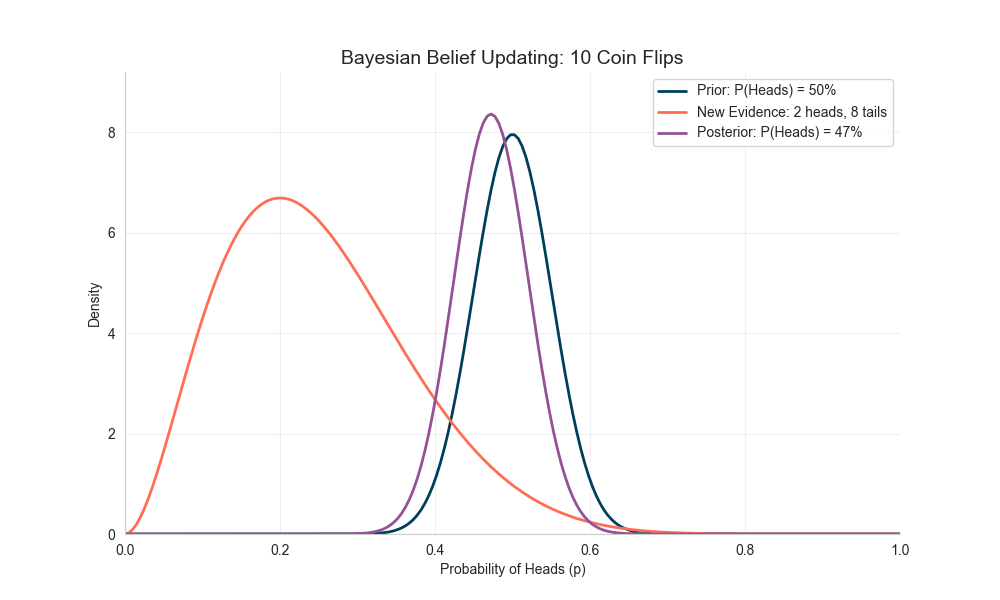
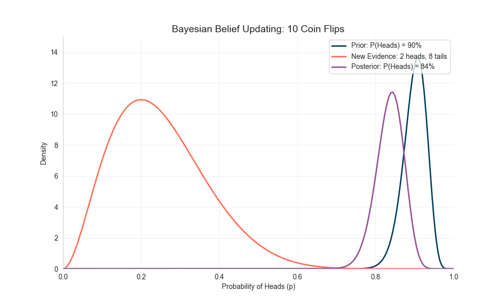
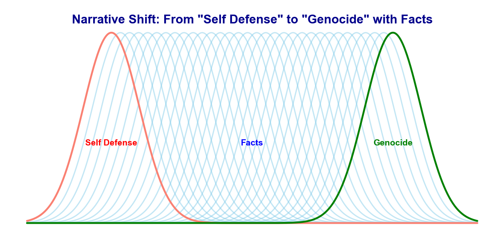

# Illusionary Truth Effect and Bayes’ Theorem

**Published:** August 22, 2025 
**Tags:** Bayesian, Lifestyle
**Excerpt:** In this blog, I gave an overview of how beliefs evolve with evidence, as explained by Bayes’ theorem, and how repetition can make false information feel true - Illusionary Truth Effect, sometimes even justifying unjustifiable actions today.
**Slug:** illusionary-truth-effect
**Cover Image Path:** blog_images/blog_08_cover.png

---
# Illusionary Truth Effect and Bayes’ Theorem

## Are beliefs constant or evolving?

Our beliefs and worldviews are not fixed—they evolve as we gather new evidence and experience different things in our lives. As children, we held very different views compared to what we have now. Growing up, through education, joy, hardship, injustice, love, and countless other experiences, our beliefs either shifted or became more consolidated. A year from now, your worldview might not be exactly the same as it is today, depending on the information you consume.  

Information can come from anywhere: social media, TV, movies, books, the environments we spend time in, our friends, and so on.

This evolution of worldview can touch every domain—politics, science, religion, the meaning of life, and more.  

However, the *type of information* we consume is crucial—it either shifts our worldview or strengthens the one we already have. For example:  
- If we only expose ourselves to familiar or supportive information, our confidence in existing beliefs grows. It becomes harder to convince us of opposing ideas.  
- If we expose ourselves to new or contradictory information, our beliefs may shift—or even overturn completely. The extent and frequency of exposure matter a lot in determining how quickly this shift happens.  

Consider this example:  
- Suppose you believe that Muslims are terrorists (*shaped, perhaps, by Western media or events like 9/11*). You then consume arguments reinforcing this idea—books, videos, and friends who support the same worldview. Over time, your belief hardens so much that no one can convince you otherwise.  
- But if you step outside that bubble and engage with neutral arguments (e.g., *maybe terrorists, maybe not*), you might reach a middle ground—neither fully supporting nor rejecting the idea.  
- If you continue to consume arguments disproving the stereotype—making Muslim friends, reading different books, watching alternative perspectives—eventually your earlier belief fades. At some point, you might even come to admire Islam deeply enough to embrace it.  

This isn’t just theory. There are real-life examples, such as [Joram Jaron van Klaveren](https://en.wikipedia.org/wiki/Joram_van_Klaveren), a former Dutch parliament member who was initially outspoken against Islam. He even began writing an anti-Islam book to show the world how “evil” Islam supposedly was. Yet, during his research, he encountered evidence that changed his mind. He converted to Islam and began spreading the truth he had discovered through his book.  

This dynamic shift in belief is exactly what **Bayes’ theorem** models mathematically. It shows, in formal terms, how beliefs can update as new data comes in.


## Bayesian View of Evolving Beliefs

Bayes’ theorem is a rule in probability that tells us how to update our beliefs when new evidence appears. In other words, it formalizes belief-updating:

$$
\text{Posterior} = \text{Prior} \times \text{Evidence}
$$

- **Prior** = your initial belief  
- **Evidence** = new data you observe  
- **Posterior** = your updated belief  

Or, in more formal notation:  

$$
P(A|B) = \frac{P(B|A) \cdot P(A)}{P(B)}
$$

Essentially, this means our initial beliefs are affected by the evidence we encounter—they either shift or get stronger. But once the evidence (the likelihood, or data) becomes large enough, the prior belief matters less and less. At some point, no matter what you believed initially, the data dominates, and your posterior belief aligns with the evidence—even if it contradicts your starting assumption.


### Example: The Unknown Coin
- Suppose I hand you a coin and ask, *“What’s the probability of heads?”*  
  Naturally, you’d assume 50%, expecting a fair coin.  
- Then we test it:  
  - After 10 flips → 2 heads, 8 tails. Suspicious, but maybe too small a sample.  
  - After 50 flips → 8 heads, 42 tails.  
  - After 100 flips → 18 heads, 82 tails.  
  - After 10,000 flips → 1,962 heads, 8,038 tails.  
- If you combine your prior belief (50%) with the data after each round, your posterior gradually shifts downward, converging around 20%.  

I simulated this in Python and illustrated it below:



Notice how the posterior distribution moves left (below 0.5) and becomes sharper with more data—the evidence clearly suggests the coin is biased toward tails.


### Example: The Unfair Coin
- Now, imagine your initial belief (prior) is extreme—you’re convinced the coin is biased toward heads, say 90%.  
- We repeat the same experiment as above.  
- At first, with small amounts of data, your strong prior dominates the outcome.  
- But as more and more flips are observed, the data eventually overwhelms the prior. The posterior converges to the evidence, even if it’s the opposite of your initial belief.  

Here’s the simulation:




This demonstrates why even deeply held beliefs (priors) can be overturned when confronted with strong, consistent, and repeated contradictory evidence.


## Illusionary Truth Effect
The [**Illusionary Truth Effect**](https://en.wikipedia.org/wiki/Illusory_truth_effect) is the psychological phenomenon that repeatedly presented statements are more likely to be judged as true even though they are false. In times of fast and easy information dissemination through social media, we also increasingly experience polarizing reporting from both reputable and less reputable sources. Repetition builds familiarity, and familiarity is mistaken for truth.

For example: [**2015 Knowledge Neglect Study**](https://www.apa.org/pubs/journals/features/xge-0000098.pdf) -  People were exposed to repeated false statements like “The Atlantic Ocean is the largest ocean on Earth.” Even participants who knew the Pacific was actually larger tended to rate the repeated (incorrect) statement as true due to familiarity and ease of processing. 

This effect is heavily exploited by mass media and political campaigns: falsehoods are repeated until they are accepted as fact. We see this today—constant propaganda conditions people to justify atrocities, occupations, ethnic cleansing, and even genocide against civilians simply because repeated misinformation has shaped their worldview.  



**Takeaway:** Be intentional about what you consume—news, books, movies, and even the company you keep. Repetition shapes belief far more than we often realize.  


## Recommendation Algorithms

Recommendation systems (e.g., YouTube, TikTok, Instagram) amplify the illusory truth effect and quickly polarize worldviews. These algorithms feed you more of what you’ve already engaged with, creating echo chambers.  

Example: You watch a few flat-earth videos → the algorithm recommends more → repetition reinforces the message → eventually, you may *believe* the earth is flat.  

**Advice:** Periodically reset your browsing history, use incognito mode, or deliberately seek diverse perspectives to avoid being trapped in algorithmic bubbles.  


## PS. Nice Names for Kids

In many cultures, children are given meaningful names—after saints, heroes, or virtues. Why? Because repetition matters. Calling a child by a noble name every day reinforces a positive identity, shaping how they see themselves over time.  

So, give children uplifting names and call them by those names—not silly nicknames. Like flipping a coin a million times, repetition nudges identity toward the meaning of the name.  


### In Short
Beliefs are Bayesian—they evolve with evidence. But repetition can trick our Bayesian minds into false certainty. Guard your inputs wisely. And **challenge false narratives that justify the unjustifiable**.  

✨✨✨ Let’s do whatever we can to save beautifully named children—from being starved, bombed in shelters, buried under rubble, or amputated at the very start of their lives. ✨✨✨

### *Appendix: Python Code for Simulation/GIF Generation*


```python
import numpy as np
import matplotlib.pyplot as plt
import seaborn as sns
from scipy.stats import beta
import matplotlib.animation as animation
from matplotlib.animation import PillowWriter

# Set up plot styling
sns.set_style("whitegrid")
plt.rcParams["figure.dpi"] = 100
high_contrast_colors = ["#003f5c", "#ff6e54", "#955196", "#2db88b"]

# True probability of heads (biased coin)
true_p = 0.2
# Create simulated data - biased coin with p(heads)=0.2
np.random.seed(42)  # For reproducibility
n_total = 10000
all_flips = np.random.binomial(1, true_p, n_total)
# Define sample sizes to show in the animation
sample_sizes = [10, 25, 50, 100, 200, 500, 1000, 2500, 5000, 10000]
# Prior parameters for a normal-like distribution centered at 0.5
a_prior, b_prior = 90, 10  # Normal-like distribution with mean 0.5
# Domain for plotting
x = np.linspace(0, 1, 200)
# Create the figure and axis for animation
fig, ax = plt.subplots(figsize=(10, 6))
# Compute prior PDF (unchanged throughout the animation)
prior_pdf = beta.pdf(x, a_prior, b_prior)


# Function to create a frame for each sample size
def create_frame(i):
    ax.clear()

    # Get the current sample size
    n = sample_sizes[i]

    # Get first n flips
    flips = all_flips[:n]
    heads = np.sum(flips)
    tails = n - heads

    # Calculate posterior parameters
    a_post = a_prior + heads
    b_post = b_prior + tails

    # Calculate distributions
    posterior_pdf = beta.pdf(x, a_post, b_post)

    # Calculate likelihood (binomial PMF up to proportionality)
    likelihood = (x**heads) * ((1 - x) ** (tails))
    # Normalize for plotting on comparable scale
    likelihood = (
        likelihood / likelihood.max() * max(prior_pdf.max(), posterior_pdf.max()) * 0.8
    )

    # Get posterior mean
    post_mean = a_post / (a_post + b_post)

    # Plot distributions
    ax.plot(
        x,
        prior_pdf,
        label="Prior: P(Heads) = 90%",
        lw=2,
        color=high_contrast_colors[0],
    )
    ax.plot(
        x,
        likelihood,
        label=f"New Evidence: {heads} heads, {tails} tails",
        lw=2,
        color=high_contrast_colors[1],
    )
    ax.plot(
        x,
        posterior_pdf,
        label=f"Posterior: P(Heads) = {post_mean:.0%}",
        lw=2,
        color=high_contrast_colors[2],
    )
    # Add frame title
    plt.title(f"Bayesian Belief Updating: {n} Coin Flips", fontsize=14)
    plt.xlabel("Probability of Heads (p)")
    plt.ylabel("Density")
    plt.ylim(0, max(prior_pdf.max(), posterior_pdf.max()) * 1.1)
    plt.xlim(0, 1)
    plt.legend(loc="upper right")
    plt.grid(alpha=0.3)
    sns.despine()

    return (ax,)


# Create the animation
ani = animation.FuncAnimation(
    fig, create_frame, frames=len(sample_sizes), interval=1000, blit=False
)

# Save the animation as a GIF
writer = PillowWriter(fps=1)
gif_path = "bayesian_updating_animation_2.gif"
ani.save(gif_path, writer=writer)
# Display the animation in the notebook
plt.close()  # Close the static figure
```
