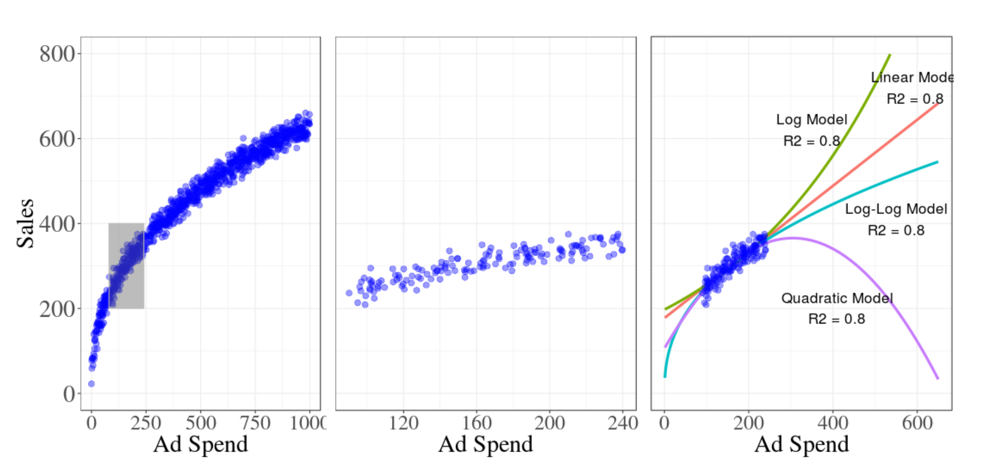

# The Blind Men, the Elephant, and the Limits of AI

**Published:** June 18, 2026 
**Tags:** Lifestyle, AI
**Excerpt:** Rumi’s parable is more relevant than ever in a world shaped by AI, model risk, and extrapolation. It shows why systems — and people — can be misled when they only see part of the truth.
**Slug:** risks-of-extrapolation
**Cover Image Path:** blog_images/11_risks_of_extrapolation/elephant_story.png

---
# The Blind Men, the Elephant, and the Limits of AI

## Seeing the Whole Elephant
Mavlana Rumi tells a timeless story about six men standing in a dark room, trying to understand an elephant that had been brought there from far away.

None of them could see the animal clearly, so each man reached out and touched only one part of it. One touched the leg and said, “An elephant is like a tree.” Another touched the tail and said, “No, it is like a rope.” The third touched the trunk and said, “It is like a snake.” The fourth touched the ear and said, “It is like a fan.” The fifth touched the body and said, “It is like a wall.” The sixth touched the tusk and said, “It is like a spear.”

Each of them was partly right. But none of them knew the whole truth. Because each person had only touched one part of the elephant, each person had formed a different idea of what the elephant was. And since they could not see the full picture, they began arguing with one another.

That is the heart of the story: partial understanding can feel complete when you are standing in the dark.

And that lesson is still relevant today.

## Why the Story Still Matters
We live in a time where we are surrounded by information, but that does not necessarily mean we understand more. In many ways, it means the opposite. We see fragments, summaries, screenshots, clips, dashboards, metrics, and outputs. But fragments are not the same as truth.

This is especially important now that AI is being used in almost every field. Models can be powerful, fast, and useful, but they are still limited by the data they were trained on. They learn patterns from the past. They can interpolate within familiar ranges. But when they are pushed beyond that range, they can become unreliable.

That is where extrapolation becomes dangerous.

A model may look impressive when it is tested on data similar to what it has already seen. But outside that range, the behavior can change in surprising ways. In other words, a model can be accurate in one corner of the elephant and still be wrong about the rest.

## The Tesla Example
A recent example that many people have been talking about is the reported [Tesla driver-monitoring trick in China](https://www.linkedin.com/posts/onurszgin_tesla-autopilot-selfdrivingcars-share-7472999058576551936-h0RL/?utm_source=share&utm_medium=member_desktop&rcm=ACoAAALu04cBkU03w42iHt0L_3VtBfdjv4ym6LU).

According to these reports, some drivers used small plastic figurines or doll heads to fool the car’s cabin camera. The system was designed to check whether the driver was paying attention to the road while using Autopilot or Full Self-Driving features. But by placing a fake head near the camera, some drivers were able to make the system think a real person was watching, even when they were not.

That example is clever, but it is also unsettling.

It shows how a system can be smart, useful, and technologically advanced, yet still be tricked if it only sees a slice of reality. The camera was looking for a pattern. The drivers found a way to imitate that pattern. The system did what it had been trained to do, but it did not truly understand the human behavior behind it.

That is very similar to the elephant story.

The camera saw a face-like object and assumed attention. The drivers knew how to exploit the gap between appearance and reality. And once again, the lesson becomes clear: seeing one part of a system is not the same as understanding the whole system.

## What Models Teach Us
This idea is also visible in statistical modeling and machine learning.

A model can fit a dataset very well and still fail when asked to predict beyond the observed range. In fact, several different models can all fit the same historical data fairly well while producing very different forecasts outside that range. That is why model choice matters so much.

[Google’s work on media mix modeling](https://research.google/pubs/challenges-and-opportunities-in-media-mix-modeling/) makes a similar point. When models are trained on a limited range of data, several very different curves can fit that range well, yet behave very differently outside it.

This is not just a technical problem. It is also a mindset problem.

When we trust a model too quickly, we may confuse a good fit with a good understanding. But a model is only as good as the assumptions, data, and boundaries behind it. If those boundaries are narrow, then the model may be acting like one of the blind men in the story: confident, but incomplete.

This is exactly why we need to be careful in analytics, forecasting, marketing mix modeling, customer segmentation, product planning, and almost every other data-driven domain.

A clean fit on historical data is not enough. We need to ask:

- What range did the model actually see?

- What happens outside that range?

- Are we observing real structure, or just a pattern inside the training window?

- Are there hidden assumptions we are not accounting for?

Those questions matter because they force us to look beyond the obvious.

## A Practical Lesson for AI and Decision-Making
The deeper lesson from Rumi’s story is not just about blind men and an elephant. It is about humility.

It reminds us that people, like models, can be limited by what they have seen. We often build strong opinions from weak evidence. We often defend our interpretation of reality without realizing we are only holding a piece of it.

That is especially dangerous in an AI world.

AI can generate answers quickly, but quick answers are not always complete answers. A recommendation engine, a forecasting model, a computer vision system, or a language model may all be useful — but only if we remember that each one is operating within limits.

If we do not understand those limits, we may mistake a partial signal for a full truth.

That is why the safest approach is not blind trust, but careful interpretation. Not just asking, “What does the model say?” but also, “What can the model not see?”

## Final Thought
In life, in business, and in machine learning, it is easy to fall in love with a small piece of evidence and build a full story around it.

But Rumi’s story reminds us to pause.

Before making decisions, before trusting a model, and before speaking too confidently about what we think we know, we should ask ourselves whether we are seeing the whole elephant or only one part of it.

Because in the dark, even a rope can look like a snake.